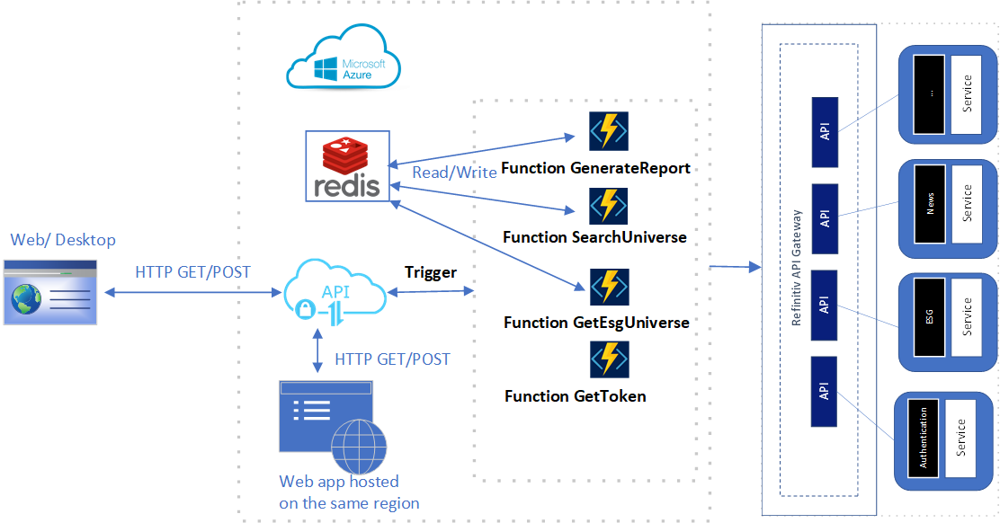
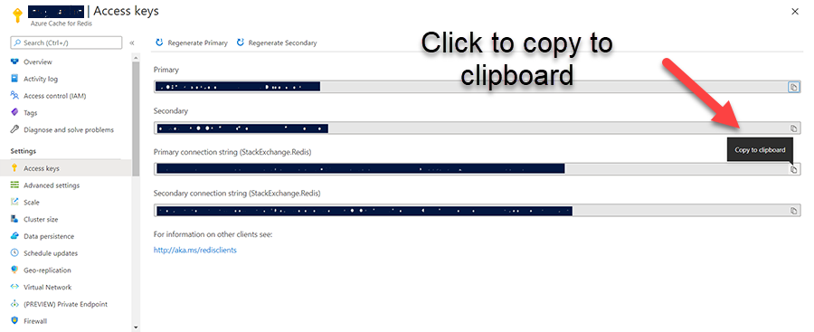
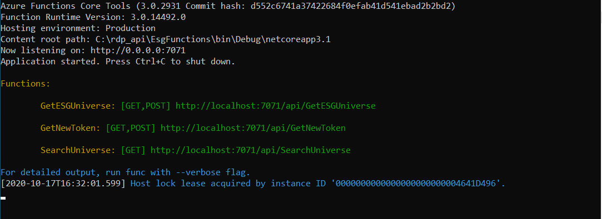
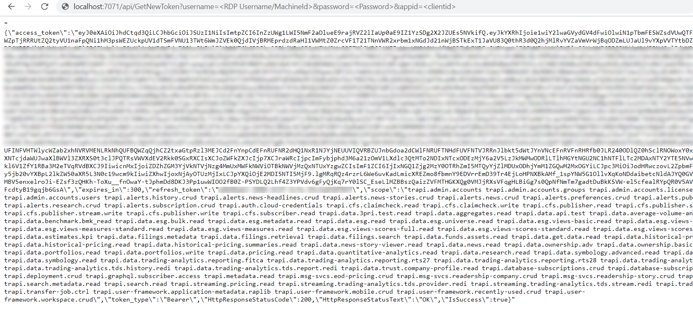
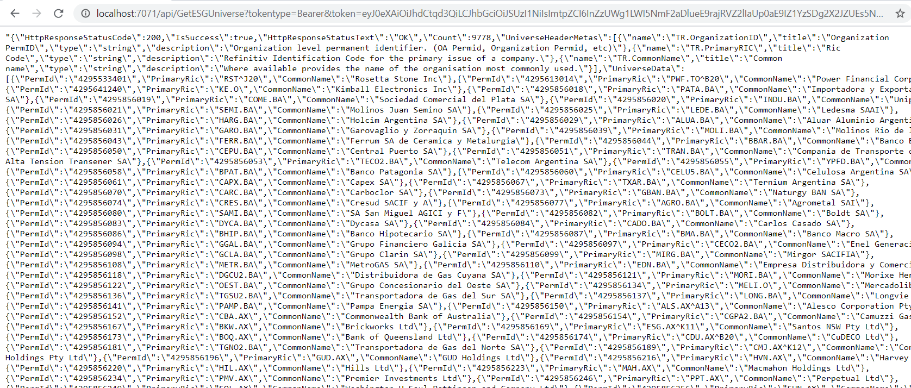
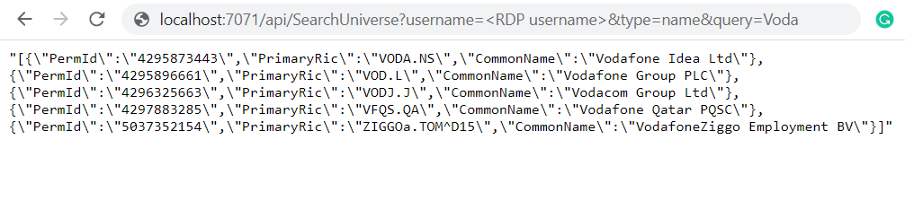
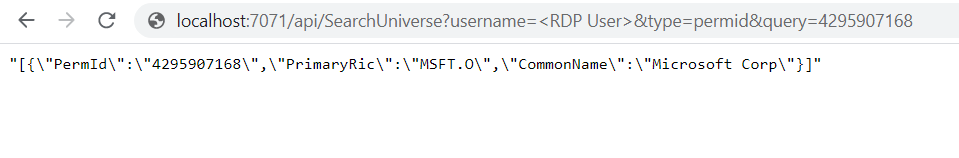

# Getting started using Azure Serverless Function with RDP REST API

There are questions from users who currently develop and deploy their applications and services on Microsoft Azure. They want to know if it is possible to create a serverless function to retrieve data from the Refinitiv Data Platform (RDP). Basically, RDP represents an ability to integrate data and services and workflows directly in the Public Cloud or on-premise environments with Internet-based delivery. RDP itself is predominantly built on AWS but eventually will support delivery into cloud-native services. Thus it should have no problem connecting to the RDP API interfaces on AWS using the Azure app or services. This article will create Azure serverless functions to demonstrate basic workflows to utilize the RDP API to retrieve data from the RDP server.

## Serverless Architecture overview

Serverless architectures is an increasingly popular approach to application development. The following is a brief summary concept of the serverless function and serverless architecture

__Serverless Architecture__ (also known as serverless computing or function as a service, FaaS) are application designs that incorporate third-party "Backend as a Service" (BaaS) services and that include custom code run in managed, ephemeral containers on the FaaS platform. Using these ideas, and related ones like single-page applications, such architectures remove much of the need for a traditional always-on server component. Serverless architectures may benefit from significantly reduced operational cost, complexity, and engineering lead time, at the expense of increased reliance on vendor dependencies and comparatively immature supporting services[1].

Use cases for FaaS are associated with "on-demand" functionality that enables the supporting infrastructure to be powered down and not incurring charges when not in use. Examples include data processing (e.g., batch processing, stream processing, extract-transform-load (ETL)), Internet of things (IoT) services for Internet-connected devices, mobile applications, and web applications. Another Real-world use case can be creating API for an already built application without breaking down or modifying the application's current or existing functionality [2]. With a serverless architect, you can develop any new functionality as a completely isolated, single-purpose piece of code. All you have to do is upload your code and tell the platform how to provision.

Nowadays, a major cloud platform already provides a serverless computing platform. Amazon provides AWS Lambda, and Microsoft has Azure Function, while Google Cloud provides the Cloud Functions for serverless computing. Suppose you prefer the Microsoft cloud over Amazon AWS. There is no reason not to use Azure Functions, as long as it offers support for the programming languages and services required for your project. The developer has a choice to select technology based on the cloud infrastructure they deployed the apps.

## Prerequisite

* An Azure account with an active subscription. Create Azure Free Account using following [link](https://azure.microsoft.com/en-us/free/).
* Knowledge of C# programming and .NET Core SDK. We will create a serverless function using .NET Core.
* Install .NET Core 3.1 or higher.
* Visual Studio 2019 or Visual Studio Code to open and run a project.Please follow the following [guide](https://docs.microsoft.com/en-us/azure/azure-functions/functions-create-first-function-vs-code?pivots=programming-language-csharp) to configure dev environment.
* Understand a basic concept of Refinitiv Data Platform API from the [RDP API GETTING STARTED GUIDE](https://developers.refinitiv.com/en/api-catalog/refinitiv-data-platform/refinitiv-data-platform-apis/documentation).

## Serverless Function and RDP services

The following picture is a sample of architecture overview of how the Azure serverless functions work with RDP. Suppose we will create a function to get a full universe of Environmental, Social, and Governance (ESG) data from RDP.



In this sample, we create Azure serverless Function with an HTTP trigger, so the client app, such as Web client, which hosted on Azure app service and applications that hosted on a virtual machine running on the same region, can send HTTP requests to trigger the function and then process the HTTP response message. We can create Redis Cache(which is an in-memory data structure store) on Azure to cache the ESG universe data, and then other functions can write or read the data from the Cache to perform the Search and generate a Report, etc. You can configure the function to trigger another serverless function, perform other tasks, or set the output to other components such as the database. It depends on your requirement.

## RDP API usage

In this article, we will create an Azure serverless function to retrieve ESG universe data from RDP. We need to create a wrapper class on top of RDP API. Then we can use it in our serverless function. Below is a list of functions we need for our class.

1) The first one is a function that works just like an authentication proxy to get OAuth2 access token from RDP Authentication services and return the data in JSON format to the client app. It can share this function with any application that wants to get an access token from RDP.

2) The second one is the function for retrieve ESG universe data from the ESG service. The API call is time-consuming and consumes much bandwidth. This function is quite useful when the client app wants to search a Ric or PermId that is supported on ESG. It can share the data with other applications to perform tasks like generating reports etc. The application may call the serverless function just once and then write the list to Redis Cache. We can also add a serverless function to read universe data from cached data to perform other tasks.

We will create a .NET Standard wrapper class for these functions so we can re-use it later. Please note these function is for demonstration purpose only. You can use another programming language because the azure serverless function also supports other programming languages such as python, java, javascript, and Powershell. More programming language can be added to the support list in the future, so please refer to the following [page](https://docs.microsoft.com/en-us/azure/azure-functions/).

### Create a function to get RDP OAuth2 Access Token

First of all, you need to know the HTTP endpoint and HTTP request headers you need to send to the endpoint. Please refer to information from [this article](https://developers.refinitiv.com/en/article-catalog/article/oauth-grant-types-in-refinitiv-data-platform) and find more details from the quickstart and tutorial [page](https://developers.refinitiv.com/en/api-catalog/refinitiv-data-platform/refinitiv-data-platform-apis/quick-start) to set up the HTTP request headers and contents.

Our function will process the HTTP response message from the RDP server and then re-generate an output to below JSON format.

* JSON message when authentication is successful.

```json
{
    "access_token":"<Access Token>",
    "expires_in":300,
    "refresh_token":"<Refresh Token>",
    "scope":"<List of scope>",
    "token_type":"<Bearer>",
    "HttpResponseStatusCode":200,
    "HttpResponseStatusText":"OK",
    "IsSuccess":true
}
```

* JSON message when authentication is failed.

```json
{
    "error":"Error Message such as access_denied",
    "error_description":"Error Description such as Invalid username or password.",
    "HttpResponseStatusCode":400,
    "IsSuccess":false,
    "HttpResponseStatusText":"Response Status Text such as Bad Request"
}
```

#### Implementation

The function will use the IHttpClientFactory interface, which can configure and create HttpClient instances in an app through Dependency Injection (DI). It also provides extensions for Polly-based middleware to take advantage of delegating handlers in HttpClient. You can find more details about the interface from [online document](https://docs.microsoft.com/en-us/dotnet/architecture/microservices/implement-resilient-applications/use-httpclientfactory-to-implement-resilient-http-requests).

Below is a snippet of codes from the functions. You can find full source files from [Github](https://github.com/Refinitiv-API-Samples/Article.RDPAPI.DotNet.AzureServerlessFunctionExample.git). It's source codes from RdpManager.cs provided under __rdp_api_lib__ folder.

* The main interface for GetToken function.

```c#
 // Class use HttpClient Factory to manage the Http Request
 private readonly IHttpClientFactory _clientFactory;

 public async Task<IRdpResponseMessage> GetToken(string username, string password, string client_id,string scope="trapi",string refreshToken = null,
            bool useRefreshToken = false, string redirectUrl= null)
{
    //... Implementation ...
}
```

* Create Http Post request message and generate a request content. We need to pass a form URL encoded content to the request body.

```c#
    // Create HTTP Post request
    var request = new HttpRequestMessage(HttpMethod.Post, tokenUri.ToString());

    // Construct request body
    var queryStringKV = new List<KeyValuePair<string, string>>
    {
        new KeyValuePair<string, string>("username", username),
        new KeyValuePair<string, string>("client_id", client_id)
    };

    if (useRefreshToken)
    {
        queryStringKV.Add(new KeyValuePair<string, string>("grant_type","refresh_token"));
        queryStringKV.Add(new KeyValuePair<string, string>("refresh_token", refreshToken));
    }
    else
    {
        queryStringKV.Add(new KeyValuePair<string, string>("takeExclusiveSignOnControl","True"));
        queryStringKV.Add(new KeyValuePair<string, string>("scope", scope));
        queryStringKV.Add(new KeyValuePair<string, string>("grant_type", "password"));
        queryStringKV.Add(new KeyValuePair<string, string>("password",password));
    }

    // Set Content
    request.Content = new FormUrlEncodedContent(queryStringKV);

    // Set Request Headers
    request.Content.Headers.ContentType = new MediaTypeHeaderValue("application/x-www-form-urlencoded");
    request.Headers.Add("AllowAutoRedirect","False");
    // Create client and call SendAsync
    var client = _clientFactory.CreateClient();
    var response = await client.SendAsync(request);
```

* Process the HTTP response from RDP and re-generate the JSON response message to the client app. Both RdpTokenResponse and RdpAuthenticationError implement IRdpResponseMessage, so we create a separate object for either the authentication request's success or failure.

```c#
    // Authentication Success return RdpTokenResponse
    IRdpResponseMessage rdpTokenResult = new RdpTokenResponse();
    if (response.IsSuccessStatusCode)
    {
        if (response.Headers.TransferEncodingChunked==true || response.Content != null)
        {
            var json= await response.Content.ReadAsStringAsync();
            rdpTokenResult = JsonConvert.DeserializeObject<RdpTokenResponse>(json);
        }
        rdpTokenResult.HttpResponseStatusCode = response.StatusCode;
        rdpTokenResult.HttpResponseStatusText = response.ReasonPhrase;
        return rdpTokenResult;
    }

    // Authentication fails, return RdPAuthenticationError instead.
    rdpTokenResult =new RdpAuthenticationError();

    if (response.Content != null)
    {
        var json = await response.Content.ReadAsStringAsync();
        rdpTokenResult=JsonConvert.DeserializeObject<RdpAuthenticationError>(json);
    }
    rdpTokenResult.HttpResponseStatusCode = response.StatusCode;
    rdpTokenResult.HttpResponseStatusText = response.ReasonPhrase;
    return rdpTokenResult;
```

### Create function to retreive ESG universe

To access ESG data, you need to know HTTP endpoint and HTTP request headers. Please find the required headers and parameters from [APIDOC page](http://apidocs.refinitiv.com/) and go to the environmental-social-governance section. To access data from RDP services, you need to set a valid access token to the HTTP Authorization header. So your application needs to call the GetToken function first. Or pass access token from your own library to this function.

Below is an ESG universe endpoint on the RDP server.

```c#
/data/environmental-social-governance/v1/universe
```

In case the request is successful, we need to process ESG data from the HTTP response message. The returned data will be a list of ESG universe that contains Ric name, PermId, and Common Name. See below sample JSON message for a template of the output.

Below is a JSON message for the case that request is successful. It contains a list of PermId, Primary Ric, and CommonName fields.

```json
{
    "HttpResponseStatusCode": 200,
    "IsSuccess": true,
    "HttpResponseStatusText": "OK",
    "Count": <Number of universe listed under UniverseData>,
    "UniverseHeaderMetas": [
        {
            "name": "Name such as TR.OrganizationID",
            "title": "Title such as Organization PermID",
            "type": "string",
            "description": "Description about the column header"
        },
        ...
    ],
    "UniverseData": [
        {
            "PermId": "<PermID>",
            "PrimaryRic": "<RIC>",
            "CommonName": "<Common Name>"
        },
        ....
    ]
}
```

And the following sample JSON message generated when there is an error occurs with the request. ESG services will generate the code, id, message, and status.

```json
{
    "HttpResponseStatusCode": 0,
    "IsSuccess": false,
    "HttpResponseStatusText": null,
    "code": "401",
    "id": "0950c4fc-9b01-4f02-8bdc-32b877004635",
    "message": "token expired",
    "status": "Unauthorized"
}
```

#### Implementations

Let see the main interface for the GetEsgUniverse function. You can find full source codes from EsgManager.cs prvoided under [rdp_api_lib](https://github.com/Refinitiv-API-Samples/Article.RDPAPI.DotNet.AzureServerlessFunctionExample.git) project.

```c#
private readonly IHttpClientFactory _clientFactory;

public async Task<IRdpResponseMessage> GetEsgUniverse(string requestToken, string tokenType="Bearer", string redirectUrl = null)
{
    //... Implementation ...
}
```

Setup Http GET request message and pass access token with a token type to the Authorization headers.

```c#
    var request = new HttpRequestMessage(HttpMethod.Get, tokenUri.ToString());

    // Set Request Headers
    request.Headers.Authorization = new AuthenticationHeaderValue(tokenType,requestToken);
    request.Headers.Add("AllowAutoRedirect", "False");
    var client = _clientFactory.CreateClient();
    var response = await client.SendAsync(request);
```

Process ESG response message and parse the data to create a RdpEsgResponse object.

```c#
    var rdpEsgResponse = new RdpEsgResponse();
    if (response.IsSuccessStatusCode)
    {
        if (response.Headers.TransferEncodingChunked == true || response.Content != null)
        {
            var json = await response.Content.ReadAsStringAsync();

            // Parse JSON Message and Trasnform the JSON response message from RDP server to a new JSON format/template
            var jsonObject=JObject.Parse(json);
            if (jsonObject["links"]?["count"] != null)
                rdpEsgResponse.Count = long.Parse(jsonObject["links"]["count"].ToString());

            rdpEsgResponse.UniverseHeaderMetas = jsonObject["headers"]?.ToObject<IList<EsgUniverseHeaderMeta>>();
            var esgData = jsonObject["data"]?.ToObject<IList<IList<string>>>();
            if (esgData != null)
            {
                rdpEsgResponse.UniverseData = new List<EsgUniverseData>();
                foreach (var esgUniverse in esgData.ToList())
                {
                    var esg = new EsgUniverseData();
                    for (var index = 0; index < esgUniverse.Count ; index++)
                    {
                        switch (index)
                        {
                            case 0:
                                esg.PermId = esgUniverse[index];
                                break;
                            case 1:
                                esg.PrimaryRic = esgUniverse[index];
                                break;
                            case 2:
                                esg.CommonName = esgUniverse[index];
                                break;
                        }
                     }
                    rdpEsgResponse.UniverseData.Add(esg);
                }
            }
        }
        rdpEsgResponse.HttpResponseStatusCode = response.StatusCode;
        rdpEsgResponse.HttpResponseStatusText = response.ReasonPhrase;
        return rdpEsgResponse;
    }
```

If an error occurs on ESG Services, the application needs to parse the error from the JSON message and return the JSON message created from RdpESGResponse class instead.

```c#
    var rdpEsgErrorResponse = new RdpEsgError();

    if (response.Content != null)
    {
        var json = await response.Content.ReadAsStringAsync();
        rdpEsgErrorResponse = JObject.Parse(json)["error"]?.ToObject<RdpEsgError>();
    }
    rdpEsgResponse.HttpResponseStatusCode = response.StatusCode;
    rdpEsgResponse.HttpResponseStatusText = response.ReasonPhrase;
    return rdpEsgErrorResponse;
```

## Create an Azure Serverless Functions

Basically, Azure provides several Function Templates to support various types of triggers. In this article, we will create Azure Serverless using the HTTP Trigger function template. So it can support several kinds of project and programming language which provides HTTP client and JSON parser library.

You can try to create the function yourself. Please follow the instruction from the following [online document](https://docs.microsoft.com/en-us/azure/azure-functions/functions-create-your-first-function-visual-studio) from Microsoft website to install Azure development tool or SDK and then create a function using [Visual Studio 2019](https://docs.microsoft.com/en-us/azure/azure-functions/functions-create-your-first-function-visual-studio) or [Visual Studio Code](https://docs.microsoft.com/en-us/azure/azure-functions/functions-create-first-function-vs-code?pivots=programming-language-csharp).

Visual Studio 2019.

* Select project template Azure Functions


* Select Http Trigger. Set the Authorization Level to anonymous in the development environment; you need to change it in production.


Visual Studio Code


After following the document to create a project,  Visual Studio will automatically create a function named httpexample. But in this project, we will use dependency injection, so we need to follow the following [guide](https://docs.microsoft.com/en-us/azure/azure-functions/functions-dotnet-dependency-injection) to install addition library from Nuget and then add FunctionsStartup to the project. We will add HTTP Client to the Startup service to pass it to our wrapper class and functions we created earlier.

In the full source file, there will be a new class in Startup.cs. The implementation will be the same as the following sample codes. We need to add  Microsoft.Extensions.Http from Nuget to the project.

```c#
using Microsoft.Azure.Functions.Extensions.DependencyInjection;
using Microsoft.Extensions.DependencyInjection;

[assembly: FunctionsStartup(typeof(RdpFunctions.Startup))]

namespace RdpFunctions
{

    public class Startup : FunctionsStartup
    {
        public override void Configure(IFunctionsHostBuilder builder)
        {
            builder.Services.AddHttpClient();

        }
    }
}
```

We will add RdpFunctions.cs to the project and remove the static class automatically created from the project template. Then create class RdpHttpTrigger to implement the serverless functions.

```c#
public class RdpHttpTrigger
{
    private readonly IHttpClientFactory _client;
    public RdpHttpTrigger(IHttpClientFactory httpClient)
    {
        this._client = httpClient;
    }
}
```

### Create serverless function to get access token

In this step, we will add a reference to the wrapper class project we talk about earlier. We will add IRdpAuthorizeService to RdpHttpTrigger. And then pass the HTTP client to the constructor of this class. The instance of IRdpAuthroizeService will utilize the HTTP client from the HTTP Client Factory we have created.  Please refer to a full source files from RdpFunctions.cs provided under [RdpAzureFunctions](https://github.com/Refinitiv-API-Samples/Article.RDPAPI.DotNet.AzureServerlessFunctionExample.git) project .

```c#
private readonly IHttpClientFactory _client;
private readonly IRdpAuthorizeService _authService;
public RdpHttpTrigger(IHttpClientFactory httpClient)
{
    this._client = httpClient;
    _authService = new RdpAuthorizeService(_client);
}
```

Next step, we will create the first serverless functions named GetNewToken to get Access Token from RDP. It will accept both HTTP Get and Post and return the response in JSON format. We need to parse the username, password, and the appid from the HTTP request message in this function. Since we isolate the client app's functionality and deploy it as a serverless function on the cloud instead. Hence the client application does not require our wrapper class in their projects(unless it's a .NET Core app that wants to use it to deserialize JSON message back to object). The client app does not need to worry about maintaining an RDP endpoint when it has any change. The client app can implement any programming language that can send HTTP requests to trigger the serverless functions. You can use simple tools like Soap UI or Chrome Browser to test the Azure Functions.

Below are sample codes from the GetNewToken functions.

```c#
  [FunctionName("GetNewToken")]
        public async Task<IActionResult> GetNewToken(
            [HttpTrigger(AuthorizationLevel.Function, "get", "post", Route = null)]
            HttpRequest req,
            ILogger log)
        {
            var username = string.Empty;
            var password = string.Empty;
            var appId = string.Empty;
            var useRefreshToken = "false";
            var refreshToken = string.Empty;
            if (req.Method.ToLower() == "get")
            {
                username = req.Query["username"];
                password = req.Query["password"];
                appId = req.Query["appid"];
                useRefreshToken = req.Query["userefreshtoken"];
                refreshToken = req.Query["refreshtoken"];
            }
            else if (req.Method.ToLower() == "post")
            {
                var requestBody = await new StreamReader(req.Body).ReadToEndAsync();
                dynamic data = JsonConvert.DeserializeObject(requestBody);
                username ??= data?.username;
                password ??= data?.password;
                appId ??= data?.appid;
                useRefreshToken ??= data?.userefreshtoken;
                refreshToken ??= data?.userefreshtoken;
            }

            if (!string.IsNullOrEmpty(useRefreshToken) && useRefreshToken.ToLower().Contains("true"))
                useRefreshToken = "true";
            else
                useRefreshToken = "false";

            if (string.IsNullOrEmpty(refreshToken))
                refreshToken = string.Empty;

            var response = await _authService.GetToken(username, password, appId,"trapi",refreshToken,Convert.ToBoolean(useRefreshToken));

            if (response.IsSuccess)
            {
                var tokenData = response as RdpTokenResponse;
                return new JsonResult(JsonConvert.SerializeObject(tokenData));
            }

            var errorData = response as RdpAuthenticationError;
            return new JsonResult(JsonConvert.SerializeObject(errorData));
        }
```

Once you start the debug or release mode, it will show a list of HTTP Trigger functions on the console output.

```bash
Azure Functions Core Tools (3.0.2931 Commit hash: d552c6741a37422684f0efab41d541ebad2b2bd2)
Function Runtime Version: 3.0.14492.0
Hosting environment: Production
Content root path: C:\rdp_api\EsgFunctions\bin\Debug\netcoreapp3.1
Now listening on: http://0.0.0.0:7071
Application started. Press Ctrl+C to shut down.

Functions:

        GetNewToken: [GET,POST] http://localhost:7071/api/GetNewToken

For detailed output, run func with --verbose flag.

```

You can copy the GetNewToken URL and test it on a web browser like the following screenshot.


### Add function to get ESG universe

Like previous functions, we will add IEsgService, which provides a method to get the class's ESG universe.

```c#
    private readonly IHttpClientFactory _client;
    private readonly IRdpAuthorizeService _authService;
    private readonly IEsgService _esgService;
    public RdpHttpTrigger(IHttpClientFactory httpClient)
    {
        this._client = httpClient;
        _authService = new RdpAuthorizeService(_client);
        _esgService = new EsgService(_client);
    }
```

The way to add serverless is quite simple, and it's the same as the previous function. But this time, we require a user to pass an access token with Authentication type to the function. Below is a sample code from serverless functions. If you need to create an additional serverless function to request data from RDP, you may need to pass the access token to the function like this one. It depends on your design.

```c#
[FunctionName("GetESGUniverse")]
public async Task<IActionResult> GetESGUniverse(
    [HttpTrigger(AuthorizationLevel.Function, "get", "post", Route = null)]
    HttpRequest req,
    ILogger log)
{
    var token = string.Empty;
    var tokenType = string.Empty;
    var updatecache = string.Empty;
    if (req.Method.ToLower() == "get")
    {
        token = req.Query["token"];
        tokenType = req.Query["tokentype"];
    }
    else if (req.Method.ToLower() == "post")
    {
        var requestBody = await new StreamReader(req.Body).ReadToEndAsync();
        dynamic data = JsonConvert.DeserializeObject(requestBody);
        token ??= data?.token;
        tokenType ??= data?.tokentype;
    }

    var response = await _esgService.GetEsgUniverse(token, tokenType);

    // If the operions is successful, get RdpEsgResponse and return it to client.
    if (response.IsSuccess)
    {

        var esgCache = response as RdpEsgResponse;
        return new JsonResult(JsonConvert.SerializeObject(esgCache));
    }

    // If opertion return an errors, return RdpEsgError instead.
    var errorData = response as RdpEsgError;
    return new JsonResult(JsonConvert.SerializeObject(errorData));
}
```

### Use Redis for ESG data caching

It's time to add in-memory data caching to the serverless functions. We will create Redis Server on Azure and then use it to cache the response message's ESG data. You can use your Azure free account to create and test Redis Cache. Please following [guide](https://docs.microsoft.com/en-us/azure/azure-cache-for-redis/cache-dotnet-core-quickstart) to create the Redis Server.

Then go to menu Access Key from the Redis Cache page we just created and copy Primary connection string.



Then we define RediConnString to use in our functions. Note that the implementation is for development or testing purposes. In the real application, you need to add the connection string in the Azure App configuration/setting.

```c#
private const string RedisConnString="<Redis Connection String>";
```

Add additional parameters to HTTP GET/POST to tell the application to cache Redis's data. There are parameter named __updatecache__ and __username__. The updatecache (false/true) can tell the function to add data to Redis when it's true. And the username is a key in Redis Cache, which we use to save the data. We need to avoid the case that multiple users can share the same Redis Server, and it might have different permission to request the data so that the list might be different.

```c#
var token = string.Empty;
var tokenType = string.Empty;
var updatecache = string.Empty;
var username = string.Empty;
if (req.Method.ToLower() == "get")
{
    token = req.Query["token"];
    tokenType = req.Query["tokentype"];
    updatecache = req.Query["updatecache"];
    username = req.Query["username"];
}
else if (req.Method.ToLower() == "post")
{
    var requestBody = await new StreamReader(req.Body).ReadToEndAsync();
    dynamic data = JsonConvert.DeserializeObject(requestBody);
    token ??= data?.token;
    tokenType ??= data?.tokentype;
    updatecache ??= data?.updatecache;
    username ??= data?.username;
}
```

Then we will add the below codes to write the data from the response message to Redis. Note that we need to Serialize the object to JSON string to save it to the cache. Then we can read the JSON string and deserialize it to an object. RedisConnString is a connection string we defined in the class earlier.

```c#
 var esgCache = response as RdpEsgResponse;

if (!string.IsNullOrEmpty(updatecache) && !string.IsNullOrEmpty(username) && updatecache.Contains("true"))
{
    var jsonObj = new
    {
        EsgUniverseCount = esgCache.Count,
        EsgUniverseHeader = esgCache?.UniverseHeaderMetas,
        EsgUniverse = esgCache?.UniverseData,
    };
    var cache = (await ConnectionMultiplexer.ConnectAsync(RedisConnString)).GetDatabase();
    cache.StringSet(username, JsonConvert.SerializeObject(jsonObj));

}
```

### Add function to search ESG universe

Next step, I will create a serverless function named SearchUniverse to read ESG Universe data from Redis Cache and use a normal lambda expression to search data based on query parameters.

```c#
 [FunctionName("SearchUniverse")]
        public async Task<IActionResult> SearchUniverseByPermId(
            [HttpTrigger(AuthorizationLevel.Function, "get", Route = null)]
            HttpRequest req,
            ILogger log)
{
    //...
}

```

We add methods GetDataByPermID, GetDataByRic, GetDataByCommonName and GetData to our wrapper class. I will omit the codes here to make it short. You can find the implementation in the full source files. Then we will call it in the serverless function based on query parameters from HTTP GET. The user has to pass the following parameter with HTTP GET.

* __username__ is a username to get data from Redis.
* __query__ is a case sensitive search keyword. ,
* __type__ Valid value can be "any", "permit", "Eric" , and "name".

It will return a blank list when the query does not match or invalid.

```c#
var cache = (await ConnectionMultiplexer.ConnectAsync(RedisConnString)).GetDatabase();
var username = req.Query["username"];
var query = req.Query["query"];
var searchtype = (string)req.Query["type"];

if (string.IsNullOrEmpty(searchtype))
    searchtype = "any";
    var esgUniverse = cache.StringGet($"{username}");
    if (!string.IsNullOrEmpty(esgUniverse)&& !string.IsNullOrEmpty(username) && !string.IsNullOrEmpty(query))
    {
        var esgJsonObj = JObject.Parse(esgUniverse.ToString());
        var esgData = esgJsonObj["EsgUniverse"].ToObject<List<EsgUniverseData>>();

        var searchResult = new List<EsgUniverseData>();
        if(searchtype.ToLower().Contains("permid"))
            searchResult = EsgUniverseCache.GetDataByPermId(query, esgData)?.ToList();
        else
        if (searchtype.ToLower().Contains("ric"))
            searchResult = EsgUniverseCache.GetDataByRic(query, esgData)?.ToList();
        else
        if (searchtype.ToLower().Contains("name"))
            searchResult = EsgUniverseCache.GetDataByCommonName(query, esgData)?.ToList();
        else
        if (searchtype.ToLower().Contains("any"))
            searchResult = EsgUniverseCache.GetData(query, esgData)?.ToList();

        return new JsonResult(JsonConvert.SerializeObject(searchResult));
    }
return new OkObjectResult("{[]}");
```

## Build and Test the serverless functions

* Download a solution files from [GitHub](https://github.com/Refinitiv-API-Samples/Article.RDPAPI.DotNet.AzureServerlessFunctionExample.git). Then open the solution file RdpAzureFunctions.sln on Visual Studio 2019. Or you can open folder you download from GitHub on Visual Studio Code.

* Open RdpFunctions.cs and modify RedisConnString from the below line to your Redis Cache connection string you created on Azure.

```c#
   private const string RedisConnString="<Redis Connection String>";
```

* Go to folder RdpAzureFunctions and then start Debug or Release on Visual Studio 2019 or Visual Studio code. You can also launch New Terminal under Visual Studio Code and then type command __func start__ under folder RdpAzureFunctions. It will start a server and show the below console output with a list of HTTP endpoints you can run on the browser or use an HTTP client test tool, such as a Soap UI to test.



* To get data from the RDP service, you need to use GetNewToken to get the access token in the first step(unless you have your own method to get the access token in the client app). You can copy the following HTTP endpoint with query parameters to the Chrome browser to test the function.

```c#
http://localhost:7071/api/GetNewToken?username=<RDP Username>&password=<RDP Password>&appid=<client_id>
```

Below is the sample output on the Chrome browser.



You need to copy the value of access_token,token_type from the JSON response message and use it in the next function. Note that the access token has a short life of around 300 sec. Once it expired, you have to call the GetNewToken function again and pass the same user name and password. The alternative way is to use the refresh token from the response message you received previously. Pass it the function by using query parameters _refreshtoken=\<refreshtoken\>&userefreshtoken=true_ and remove the password from the HTTP get. Below is a sample function call. The result will be the same as the above sample.

```url
http://localhost:7071/api/GetNewToken?username=<RDP Username>&refreshtoken=<refresh token>&appid=<AppKey or Client Id>&userefreshtoken=true
```

If you wish to send HTTP Post to the function. You need to compose the request content in JSON message like below sample.

```json
{
    "username":"<RDP Username>",
    "password":"<RDP Password>",
    "appid":"<client id or appkey>"
}
```

And send it to

```url
http://localhost:7071/api/GetNewToken
```

* Call GetEsgUniverse to retreive ESG data.

To retrieve ESG data, simply copy the following URL to the browser. Please replaced \<Access Token\> with the token from the previous step. Note that this sample will not cache data on Redis Cache. It just returns the JSON message contains all universe list.

```url
http://localhost:7071/api/GetESGUniverse?tokentype=Bearer&token=<Acccess Token>
```

Sample output



If you wish to cache data on Redis Cache, please add _updatecache=true&username=\<RDP Username or Machine Id\>_ to the query parameters.

```url
http://http://localhost:7071/api/GetESGUniverse?tokentype=Bearer&updatecache=true&username=<RDP Username or Machine Id>&token=<Access Token>
```

It will return the same result and write the data to Redis Cache using your username as a key.

* Call SearchUniverse function to search ESG data from Redis Cache.

You can call <http://localhost:7071/api/SearchUniverse> with the following query parameters.

* __query__ is a keyword you want to search.
* __username__ is your username to retrieve data from the cache.
* __type__ is search type, and it must be one of the following values. If not set, it will use "any".
  1) "any" to search query with any fields.
  2) "permid" to search query with the value of Perm Id.
  3) "ric" to search query with Ric name.
  4) "name" to search query with the Common Name.

Below is the sample result for search by common name by using the query "Voda".

```url
http://localhost:7071/api/SearchUniverse?username=<username>&type=name&query=Voda
```



Suppose we have PermId 4295907168, which is for Microsoft, and we want to know Ric and Common name. We can use the following query to query the data.

```url
http://localhost:7071/api/SearchUniverse?username=<RDP User>type=permid&query=4295907168
```

It will show the following result.



You can try different search types and queries to find more specific data. You may add your own function to get other data like ESG basic score from  ESG endpoints so you can understand more about RDP API usage.

Pleae note that in this article we will not talk about Azure serverless function deployment. You can find additional details from [Azure Document](https://docs.microsoft.com/en-us/azure/azure-functions/functions-deployment-technologies).

## Summary

In this article, we have explained the basic concepts of the Serverless Architecture and Azure serverless function. We also provide a sample .NET Core serverless function to demonstrate a basic workflow to get Access Token from RDP. Then the user can then use the access token to retrieve ESG universe data using the RDP ESG universe API. The serverless function we create in this article is a normal function with the HTTP Trigger type, so it should be a simple sample app for a user who wants to start using RDP API to create a serverless function on Azure. After you understand a concept, you should design your app and utilize the Azure function to get any other data from the Refinitiv Data Platform.

## References

1) [Fowler, Martin (4 August 2016). "Serverless Architectures"](https://martinfowler.com/articles/serverless.html#unpacking-faas)
2) [Wiki Function as a service](https://en.wikipedia.org/wiki/Function_as_a_service)
3) [Refinitiv Data Platform (RDP) APIs](https://developers.refinitiv.com/en/api-catalog/refinitiv-data-platform/refinitiv-data-platform-apis)
4) [RDP API GETTING STARTED GUIDE](https://developers.refinitiv.com/en/api-catalog/refinitiv-data-platform/refinitiv-data-platform-apis/documentation)
5) [Compute services on Azure and AWS](https://docs.microsoft.com/en-us/azure/architecture/aws-professional/compute)
6) [Azure Function Documents](https://docs.microsoft.com/en-us/azure/azure-functions/)
